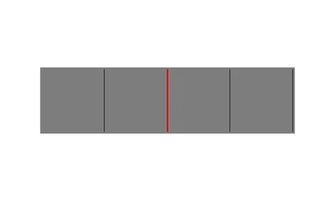
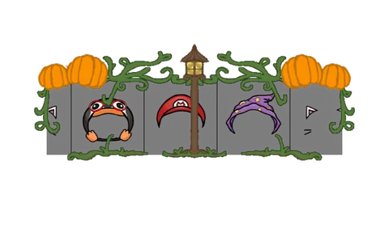
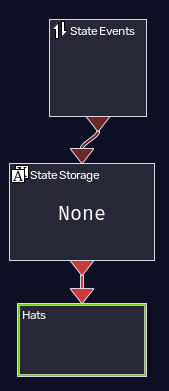
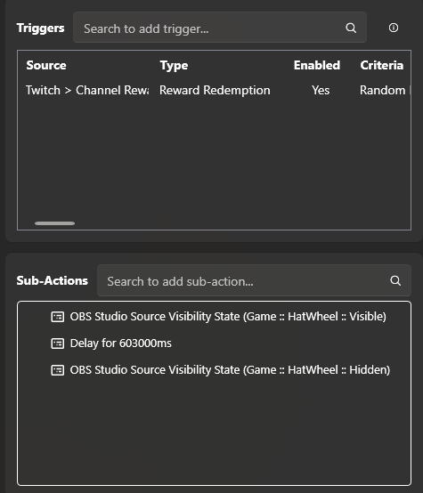

# Veadotube Avatar Wheel

A prize "wheel" that spins, lands on a random item, and switches your [Veadotube](https://veado.tube/) avatar to the matching state. Runs directly in OBS via a browser source.

Download by clicking Releases on the right.

|                     Default Template Wheel                     |                  My Personal Wheel                  |
| :--------------------------------------------------------: | :----------------------------------------------------------: |
|  |  |

## Features

- Animated spinning wheel with a ticking sound and a win sound (or your own custom sounds!)
- Editable weight values to adjust rarity
- Editable win cooldown so viewers don't get the same state multiple times in a row
- Automatically sends the state event to Veadotube via websocket
- Automatically reverts to a default state after a delay
- Optional custom overlay image

## Requirements

- [Veadotube](https://veado.tube/) running with a **State Events** node set up on your avatar and a websocket.
- OBS or another streaming program.
- Streamer.Bot for automation with Channel Points.

## Setup

1. **Find your Node ID.** In Veadotube, right-click your State Events node and copy its ID.
2. **Open `wheel.html`** in a text editor (Such as Notepad or Visual Studio Code) and set:
   ```js
   const NODE_ID = "your-node-id-here";
   ```
3. **Add your images.** For each entry in the `outcomes` array, link an image file path. This path must be relative to where wheel.html is saved. (You can read more about that in the wheel.html file itself.)
   ```js
   const outcomes = [
       { img: "Item1.png", stateId: "State1", name: "Item One", weight: 1, color: "#B0C3D9", sound: "" },
   ];
   ```
4. **Add `wheel.html` as a Browser Source** in OBS and resize as needed. Make sure to toggle "Control audio via OBS" to adjust the audio. You should also enable "Refresh browser when scnee becomes active" if you want to automate it with Streamer.bot.
5. **SPIN!!!** Keep the source visible and hit refresh to spin it! 

Minimum Required Node Graph Example:



## Streamer.bot Automation Setup

1. **Add an Action**. Go to Actions and create a new action named whatever you want.
2. **Add a Trigger**. Set the trigger to your Channel Point Redemption.
3. **Create Sub-Actions.** Set three sub-actions, the first will make the HatWheel source visible, the second will be delay which should be longer than: 
   ```js
   const REVERT_DELAY_SECONDS = 600;
   ```
   and finally the third will make the HatWheel source not visible.

Minimum Required Streamer.bot Actions Example:



## License

GPLv3 - see [LICENSE](LICENSE).

By Adrimark! If you find it useful, consider [supporting me!](https://shop.markcraft.org/pages/donate).
